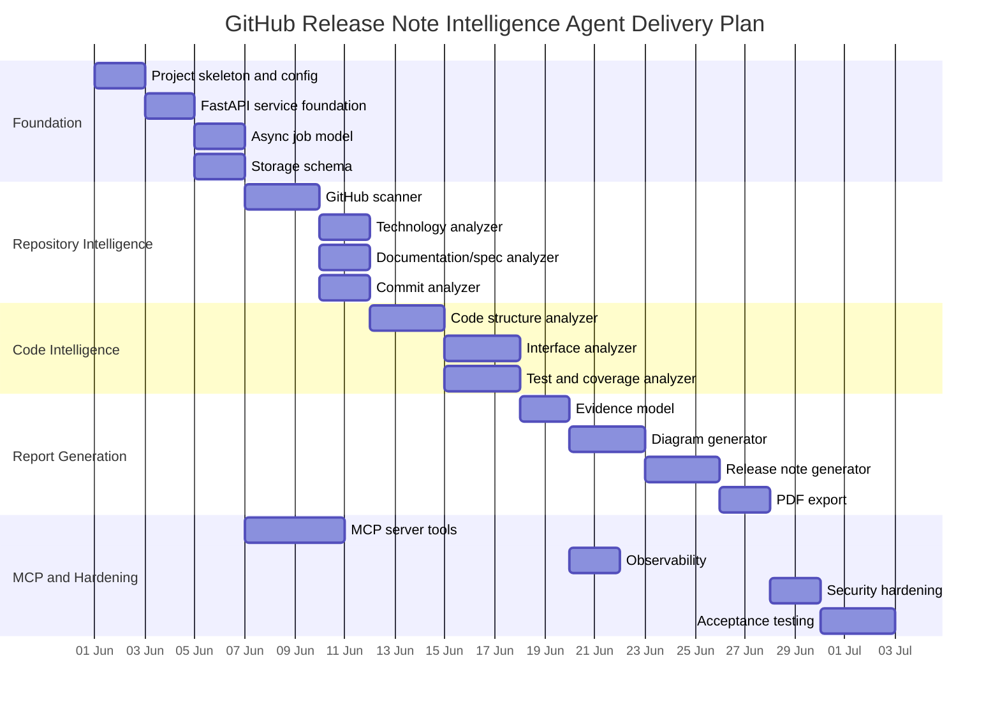
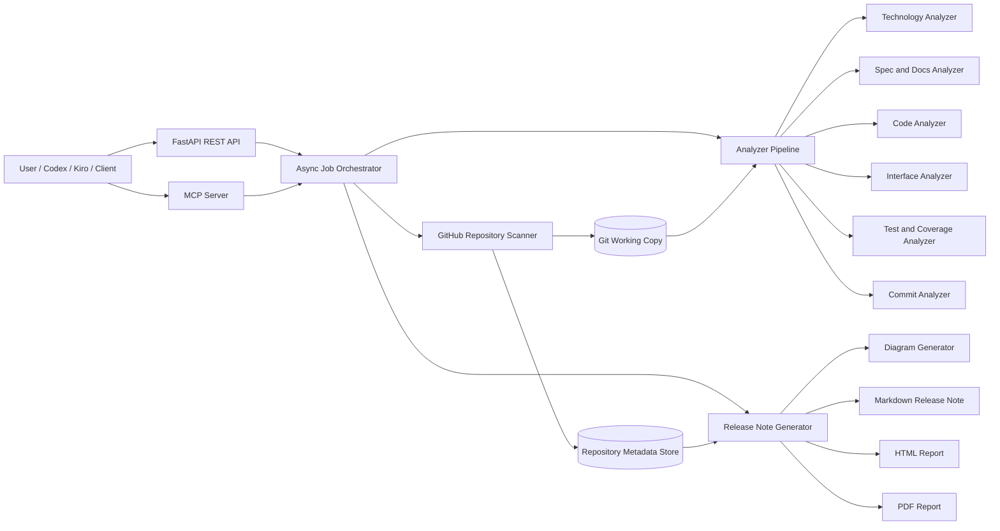
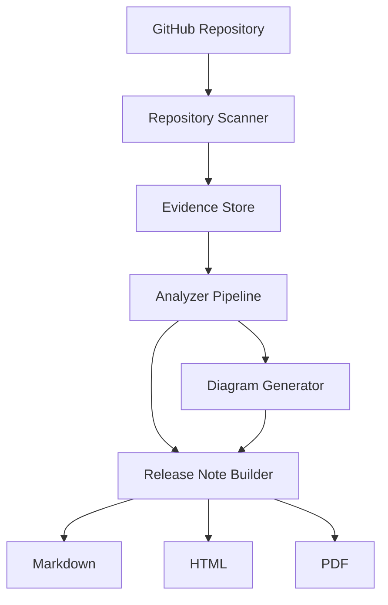
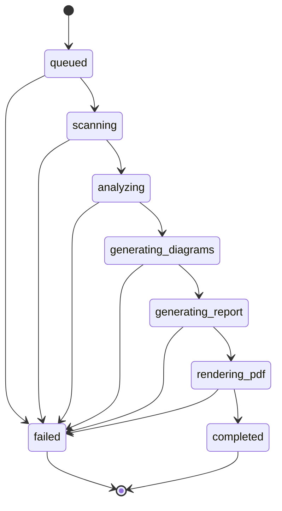

# PLAN.md — GitHub Release Note Intelligence Agent

## 1. Purpose

This `PLAN.md` converts the approved `SPEC.md` into an executable engineering plan for building the **GitHub Release Note Intelligence Agent**.

The agent will scan a public GitHub repository, understand the project, analyze code, specs, tests, coverage, commits, interfaces, and architecture evidence, then generate a professional release note with diagrams, analytics, and PDF-ready output.

This plan follows the **Intent → SPEC → PLAN → Tasks → Code** workflow shown in the reference diagram.

---

## 2. Planning Principles

| Principle | Meaning |
|---|---|
| Spec-first | No implementation should start without a mapped requirement from `SPEC.md`. |
| Plan-before-code | Each feature must be decomposed into modules, tasks, tests, and acceptance checks before coding. |
| Evidence-driven | Release-note content must be generated from repository evidence, not assumptions. |
| Async-by-default | Repository scanning, analysis, and report generation must run as asynchronous jobs. |
| API + MCP dual mode | The same core agent capability must be exposed through REST APIs and MCP tools. |
| Human-reviewable | Generated release notes must include confidence, warnings, gaps, and traceability. |
| Diagram-as-code | Mermaid, C4, deployment, and flow diagrams must be generated as editable text artifacts. |
| Safe execution | The agent must scan source repositories read-only and must not execute untrusted project code by default. |

---

## 3. Target Deliverables

The first implementation milestone must produce the following deliverables:

1. Python FastAPI service.
2. MCP-compatible server/tool surface.
3. Async job execution layer.
4. GitHub repository scanner.
5. Repository metadata and evidence store.
6. Commit-history analyzer.
7. Technology and toolchain analyzer.
8. Specification and documentation analyzer.
9. Code structure and interface analyzer.
10. Test and coverage analyzer.
11. Diagram generator.
12. Release-note generator.
13. Markdown, HTML, and PDF export pipeline.
14. Basic UI/API response for job status and artifact download.
15. Observability hooks for logs, traces, and metrics.

---

## 4. Scope Breakdown

### 4.1 In Scope

| Area | In Scope |
|---|---|
| Repository source | Public GitHub repositories. |
| Scan mode | Read-only clone or GitHub API scan. |
| Language detection | Python, JavaScript/TypeScript, Java, Go, YAML, Markdown, Docker, Helm/Kubernetes. |
| Git analysis | Commit history, tags, release ranges, changed files, contributors, commit categories. |
| Code analysis | Directory/module inventory, entrypoints, APIs, dependencies, interfaces, config files. |
| Test analysis | Unit test discovery, test framework detection, test result parsing where artifacts exist. |
| Coverage analysis | Coverage file discovery and parsing where available. |
| Spec analysis | Root `SPEC.md`, `HLD.md`, `LLD.md`, `README.md`, module-level specs, docs. |
| Diagrams | Mermaid flow, C4 context/container/component, deployment topology, module dependency view. |
| Output | Professional release note in Markdown, HTML, and PDF. |
| Interfaces | REST API and MCP tools. |

### 4.2 Out of Scope for MVP

| Area | Out of Scope |
|---|---|
| Private repositories | Deferred unless GitHub token integration is added. |
| Running repository code | Not allowed by default for security. |
| Automatic release publishing | Deferred. |
| GitHub PR creation | Deferred. |
| Mutation of source repo | Not allowed in MVP. |
| Perfect architecture inference | Agent must show confidence and gaps. |

---

## 5. High-Level Delivery Phases



---

## 6. Architecture Plan

### 6.1 Runtime Architecture



### 6.2 Main Components

| Component | Responsibility | Planned Implementation |
|---|---|---|
| REST API | Submit scan jobs, get status, download artifacts | FastAPI routers |
| MCP Server | Expose agent capabilities to Codex/Kiro/MCP clients | Python MCP SDK or compatible implementation |
| Job Orchestrator | Manage async job lifecycle | asyncio + worker queue abstraction |
| GitHub Scanner | Clone/fetch repo, inspect tree, collect git metadata | GitPython / pygit2 / subprocess git |
| Analyzer Pipeline | Run analyzers independently and aggregate evidence | Plugin-style analyzer registry |
| Evidence Store | Persist facts, metrics, warnings, findings | PostgreSQL + JSONB |
| Artifact Store | Persist generated Markdown/HTML/PDF/diagrams | Local filesystem first, S3-compatible later |
| Diagram Generator | Generate Mermaid/C4/deployment diagrams | Mermaid text templates |
| Release Generator | Create industry-grade release note | Jinja2 + LLM-assisted sections optionally |
| PDF Renderer | Convert HTML/Markdown into PDF | WeasyPrint / Playwright / wkhtmltopdf option |

---

## 7. Repository Structure Plan

```text
github-release-note-agent/
├── README.md
├── SPEC.md
├── PLAN.md
├── tasks.md
├── research.md
├── data-model.md
├── contracts.md
├── test.md
├── docs.md
├── pyproject.toml
├── .env.example
├── src/
│   └── release_note_agent/
│       ├── main.py
│       ├── config.py
│       ├── logging_config.py
│       ├── api/
│       │   ├── routes_health.py
│       │   ├── routes_jobs.py
│       │   ├── routes_artifacts.py
│       │   └── schemas.py
│       ├── mcp/
│       │   ├── server.py
│       │   ├── tools.py
│       │   └── schemas.py
│       ├── jobs/
│       │   ├── orchestrator.py
│       │   ├── states.py
│       │   └── worker.py
│       ├── github/
│       │   ├── scanner.py
│       │   ├── git_client.py
│       │   └── models.py
│       ├── analyzers/
│       │   ├── base.py
│       │   ├── technology_analyzer.py
│       │   ├── intent_analyzer.py
│       │   ├── commit_analyzer.py
│       │   ├── docs_analyzer.py
│       │   ├── spec_analyzer.py
│       │   ├── code_structure_analyzer.py
│       │   ├── interface_analyzer.py
│       │   ├── test_analyzer.py
│       │   └── coverage_analyzer.py
│       ├── evidence/
│       │   ├── models.py
│       │   ├── store.py
│       │   └── confidence.py
│       ├── diagrams/
│       │   ├── mermaid_generator.py
│       │   ├── c4_generator.py
│       │   └── deployment_generator.py
│       ├── reports/
│       │   ├── release_note_builder.py
│       │   ├── templates/
│       │   ├── markdown_renderer.py
│       │   ├── html_renderer.py
│       │   └── pdf_renderer.py
│       ├── storage/
│       │   ├── postgres.py
│       │   ├── artifact_store.py
│       │   └── migrations/
│       └── observability/
│           ├── tracing.py
│           ├── metrics.py
│           └── audit.py
├── tests/
│   ├── unit/
│   ├── integration/
│   └── fixtures/
├── docker/
├── helm/
└── examples/
```

---

## 8. Feature Implementation Plan

### 8.1 Feature F1 — Job Submission and Status

**Goal:** Allow clients to submit a repository scan and track progress.

**Inputs:**

```json
{
  "repo_url": "https://github.com/example/project",
  "from_ref": "v1.0.0",
  "to_ref": "v1.1.0",
  "report_profile": "enterprise",
  "include_pdf": true,
  "include_diagrams": true
}
```

**Outputs:**

```json
{
  "job_id": "uuid",
  "status": "queued",
  "status_url": "/api/v1/jobs/{job_id}"
}
```

**Implementation steps:**

1. Create `POST /api/v1/release-notes/jobs`.
2. Validate GitHub URL.
3. Create job row in PostgreSQL.
4. Enqueue async job.
5. Return job ID.
6. Create `GET /api/v1/jobs/{job_id}`.
7. Create `GET /api/v1/jobs/{job_id}/artifacts`.

**Acceptance criteria:**

- Invalid GitHub URL is rejected.
- Valid request creates a job in `queued` state.
- Job status can be queried.
- Job status includes current stage and progress percentage.

---

### 8.2 Feature F2 — MCP Tool Surface

**Goal:** Allow MCP clients to call the same agent capabilities.

**Planned MCP tools:**

| Tool | Purpose |
|---|---|
| `scan_github_repository` | Start a repository scan. |
| `get_release_note_job_status` | Read async job status. |
| `get_repository_analysis_summary` | Return current analysis summary. |
| `generate_release_note` | Generate release note from existing analysis. |
| `get_release_note_artifact` | Return artifact metadata or content reference. |

**MCP request example:**

```json
{
  "repo_url": "https://github.com/aveeshek/bosgenesis-mop-creation-agent",
  "from_ref": "auto",
  "to_ref": "HEAD",
  "include_pdf": true
}
```

**Acceptance criteria:**

- MCP and REST call paths use the same service layer.
- MCP tool does not bypass validation or security rules.
- MCP responses include job ID and status.

---

### 8.3 Feature F3 — GitHub Repository Scanner

**Goal:** Collect repository structure and metadata.

**Scanner outputs:**

| Output | Description |
|---|---|
| Repository tree | Files and directories. |
| Git metadata | Branch, tags, commits, authors, dates. |
| Candidate docs | README, HLD, LLD, SPEC, docs, module specs. |
| Candidate test files | Unit/integration/e2e tests. |
| Candidate coverage files | coverage.xml, lcov.info, htmlcov, jacoco, pytest reports. |
| Build files | pyproject, package.json, pom.xml, Dockerfile, Helm charts. |

**Implementation steps:**

1. Clone repo into isolated job workspace.
2. Checkout target ref.
3. Collect repository tree.
4. Detect file types.
5. Detect important files.
6. Extract tags and commit ranges.
7. Store metadata and raw evidence references.

**Acceptance criteria:**

- Scanner handles repositories with at least 5,000 files.
- Scanner skips `.git`, virtualenvs, node_modules, build outputs by default.
- Scanner produces a deterministic repository inventory.

---

### 8.4 Feature F4 — Technology and Toolchain Analyzer

**Goal:** Identify technologies, frameworks, runtime, build tools, and deployment tools.

**Detection rules:**

| Evidence | Possible Finding |
|---|---|
| `pyproject.toml`, `requirements.txt` | Python project. |
| `FastAPI`, `uvicorn` dependencies | FastAPI service. |
| `package.json` | Node/JS/TS project. |
| `pom.xml` | Java/Maven project. |
| `Dockerfile` | Containerized runtime. |
| `helm/Chart.yaml` | Helm-deployable application. |
| `k8s/*.yaml` | Kubernetes manifests. |
| `.github/workflows/*.yml` | GitHub Actions CI/CD. |

**Acceptance criteria:**

- Findings include evidence file path.
- Findings include confidence score.
- Unknown technologies are reported as gaps, not invented.

---

### 8.5 Feature F5 — Intent and Feature Analyzer

**Goal:** Understand the project purpose and feature set.

**Evidence sources:**

1. README.
2. SPEC/HLD/LLD.
3. API route names.
4. CLI commands.
5. Package/module names.
6. Test names.
7. Commit messages.

**Output model:**

```json
{
  "project_intent": "Generate professional release notes from GitHub repository evidence.",
  "features": [
    {
      "name": "Repository scan",
      "evidence": ["README.md", "src/github/scanner.py"],
      "confidence": 0.91
    }
  ]
}
```

**Acceptance criteria:**

- Each inferred feature includes evidence.
- Low-confidence assumptions are marked for human review.

---

### 8.6 Feature F6 — Commit History Analyzer

**Goal:** Analyze repository change history.

**Metrics:**

| Metric | Description |
|---|---|
| Total commits | Number of commits in selected range. |
| Contributors | Unique authors. |
| Changed files | Files changed by type and directory. |
| Commit categories | feat, fix, docs, test, refactor, chore, perf, security. |
| Release velocity | Commit distribution over time. |
| Hotspots | Most frequently changed files/modules. |

**Implementation steps:**

1. Resolve `from_ref` and `to_ref`.
2. Read commits between refs.
3. Categorize commits using conventional commit patterns and heuristics.
4. Aggregate changed file statistics.
5. Identify hotspots.
6. Store commit analytics.

**Acceptance criteria:**

- Works when no tags exist by using default range strategy.
- Identifies unknown/unclassified commits.
- Does not fabricate release change summaries.

---

### 8.7 Feature F7 — Code Structure Analyzer

**Goal:** Understand modules, packages, entrypoints, and key classes/functions.

**Planned approach:**

1. Build directory tree summary.
2. Parse Python files using AST where applicable.
3. Detect FastAPI routers, CLI commands, services, models, and repositories.
4. Detect JavaScript/TypeScript exports and route files using regex/AST where available.
5. Detect Java packages/classes/interfaces where applicable.
6. Generate module dependency summary.

**Acceptance criteria:**

- Does not require executing code.
- Produces module-wise summary.
- Identifies likely entrypoints.
- Marks unsupported languages as partial analysis.

---

### 8.8 Feature F8 — Interface Analyzer

**Goal:** Identify project contracts, inputs, outputs, APIs, CLI commands, environment variables, and external dependencies.

**Interface categories:**

| Category | Examples |
|---|---|
| REST APIs | FastAPI routes, Flask routes, Spring controllers. |
| CLI | Typer, argparse, Click commands. |
| MCP tools | Tool schemas and server definitions. |
| Config | `.env.example`, settings files, ConfigMaps. |
| Events | Kafka topics, CloudEvents, queue names. |
| Data contracts | Pydantic models, JSON schemas, OpenAPI specs. |

**Acceptance criteria:**

- Every discovered interface has input/output evidence where possible.
- Interfaces are grouped by type.
- Missing explicit contracts are listed as improvement recommendations.

---

### 8.9 Feature F9 — Test and Coverage Analyzer

**Goal:** Read available unit test and coverage data.

**Discovery rules:**

| Artifact | Parser |
|---|---|
| `coverage.xml` | Cobertura parser. |
| `lcov.info` | LCOV parser. |
| `htmlcov/index.html` | HTML summary parser if needed. |
| `junit.xml` | JUnit XML parser. |
| `pytest-report.xml` | JUnit-compatible parser. |
| `jacoco.xml` | JaCoCo parser. |
| `tests/` directory | Test inventory analyzer. |

**Acceptance criteria:**

- Coverage is reported only when evidence exists.
- Missing coverage is shown as `Not available` with recommendation.
- Test inventory includes framework and approximate test count.

---

### 8.10 Feature F10 — Diagram Generator

**Goal:** Generate diagrams that make the release note visually useful.

**Required diagrams:**

1. Repository analysis flow.
2. Release-note generation pipeline.
3. C4 context diagram.
4. C4 container diagram.
5. C4 component diagram.
6. Deployment diagram.
7. Interface map.
8. Optional module dependency graph.

**Example release-note generation flow:**



**Acceptance criteria:**

- Diagrams are generated as Mermaid text.
- Diagrams are embedded in Markdown output.
- HTML/PDF renderer can render or preserve diagrams.
- Low-confidence architecture edges are marked or omitted.

---

### 8.11 Feature F11 — Professional Release Note Generator

**Goal:** Generate a professional, industry-standard release note.

**Release note sections:**

1. Cover page.
2. Document control.
3. Executive summary.
4. Release scope.
5. Repository intelligence summary.
6. Technology and tools used.
7. Feature inventory.
8. Architecture overview.
9. C4 diagrams.
10. Deployment topology.
11. Interface and contract analytics.
12. Code analytics.
13. Test and coverage report.
14. Commit history and change analytics.
15. Risk and compatibility notes.
16. Known gaps and human-review items.
17. Upgrade/deployment notes if detected.
18. Appendix: evidence table.

**Acceptance criteria:**

- Output is professional and client-presentable.
- Every factual section is linked to evidence.
- Unknowns are clearly shown.
- Report can be generated without an LLM for baseline templates.
- Optional LLM enhancement must not remove evidence traceability.

---

## 9. Data Model Plan

### 9.1 Main Entities

| Entity | Purpose |
|---|---|
| `scan_job` | Tracks async scan lifecycle. |
| `repository_snapshot` | Captures repository tree and metadata. |
| `evidence_item` | Stores extracted evidence with source path. |
| `analysis_result` | Stores analyzer findings. |
| `diagram_artifact` | Stores generated diagrams. |
| `release_note_artifact` | Stores Markdown/HTML/PDF outputs. |
| `audit_event` | Stores operational audit logs. |

### 9.2 Job State Machine



### 9.3 Minimum Job Status Fields

| Field | Description |
|---|---|
| `job_id` | Unique job ID. |
| `repo_url` | Source GitHub repository. |
| `from_ref` | Start ref. |
| `to_ref` | End ref. |
| `status` | Current state. |
| `stage` | Human-readable stage. |
| `progress_percent` | Approximate progress. |
| `warnings` | Non-blocking issues. |
| `errors` | Blocking failures. |
| `artifact_ids` | Generated artifacts. |
| `created_at` | Job creation time. |
| `updated_at` | Last update time. |

---

## 10. Contracts Plan

### 10.1 REST API Contracts

| Method | Path | Purpose |
|---|---|---|
| `GET` | `/health` | Service health. |
| `POST` | `/api/v1/release-notes/jobs` | Submit analysis job. |
| `GET` | `/api/v1/jobs/{job_id}` | Get job status. |
| `GET` | `/api/v1/jobs/{job_id}/summary` | Get analysis summary. |
| `GET` | `/api/v1/jobs/{job_id}/artifacts` | List generated artifacts. |
| `GET` | `/api/v1/artifacts/{artifact_id}` | Download artifact. |

### 10.2 MCP Contracts

| MCP Tool | Maps To |
|---|---|
| `scan_github_repository` | `POST /api/v1/release-notes/jobs` |
| `get_release_note_job_status` | `GET /api/v1/jobs/{job_id}` |
| `get_repository_analysis_summary` | `GET /api/v1/jobs/{job_id}/summary` |
| `get_release_note_artifacts` | `GET /api/v1/jobs/{job_id}/artifacts` |

---

## 11. Test Plan Summary

Detailed tests should be maintained in `test.md`.

### 11.1 Unit Tests

| Module | Test Focus |
|---|---|
| Git URL validator | Valid/invalid GitHub URLs. |
| Job state machine | Valid transitions and failure transitions. |
| Technology analyzer | Dependency/build file detection. |
| Commit analyzer | Commit classification. |
| Coverage parser | Cobertura/LCOV/JaCoCo parsing. |
| Diagram generator | Valid Mermaid output. |
| Release builder | Required sections present. |

### 11.2 Integration Tests

| Scenario | Expected Result |
|---|---|
| Submit public repo job | Job completes or fails with meaningful error. |
| Repo with tests and coverage | Test and coverage sections populated. |
| Repo without coverage | Coverage marked as unavailable. |
| Repo without specs | Spec gap shown in report. |
| MCP scan request | Same result as REST job request. |

### 11.3 Acceptance Tests

| ID | Acceptance Scenario |
|---|---|
| AT-001 | Generate Markdown release note for public GitHub repo. |
| AT-002 | Generate PDF release note with diagrams. |
| AT-003 | Include commit analytics between tags. |
| AT-004 | Include technology/toolchain summary. |
| AT-005 | Include test/coverage report when available. |
| AT-006 | Show human-review warnings for missing data. |
| AT-007 | Expose workflow through MCP tools. |

---

## 12. Security Plan

| Risk | Control |
|---|---|
| Malicious repository code | Do not execute scanned code by default. |
| Large repository resource exhaustion | Enforce max repo size, file count, and timeout. |
| Secret leakage in reports | Redact known secret patterns. |
| Prompt injection from repository docs | Treat repo content as untrusted evidence. |
| Path traversal | Use isolated workspace and sanitize paths. |
| MCP misuse | Validate all MCP tool inputs. |
| Public repo ambiguity | Record exact commit SHA in report. |

---

## 13. Observability Plan

| Signal | Implementation |
|---|---|
| Logs | Structured JSON logs per job. |
| Traces | OpenTelemetry spans for scan/analyze/generate/render. |
| Metrics | Job count, duration, failure count, repo size, analyzer duration. |
| Audit | Job submitted, repo cloned, artifacts generated, artifact downloaded. |

### 13.1 Planned Trace Spans

```text
release_note_job
├── validate_request
├── clone_repository
├── collect_repository_tree
├── analyze_technology
├── analyze_docs_and_specs
├── analyze_commits
├── analyze_code_structure
├── analyze_interfaces
├── analyze_tests
├── analyze_coverage
├── generate_diagrams
├── build_release_note_markdown
├── render_html
├── render_pdf
└── persist_artifacts
```

---

## 14. Implementation Milestones

### Milestone 1 — Foundation

**Objective:** Create runnable service skeleton.

**Deliverables:**

- Project structure.
- FastAPI app.
- Config loader.
- Health endpoint.
- Basic logging.
- Job model.
- Local artifact store.

**Exit criteria:**

- `pytest` passes.
- `/health` returns healthy.
- Job can be created in local memory or DB.

---

### Milestone 2 — GitHub Scan MVP

**Objective:** Clone and inventory public repositories.

**Deliverables:**

- GitHub scanner.
- Repo tree summary.
- File classification.
- Commit/tag extraction.
- Workspace cleanup.

**Exit criteria:**

- Public repo can be scanned.
- Repository summary is stored.
- Large/generated folders are skipped.

---

### Milestone 3 — Analyzer MVP

**Objective:** Generate useful repository intelligence.

**Deliverables:**

- Technology analyzer.
- Docs/spec analyzer.
- Commit analyzer.
- Code structure analyzer.
- Interface analyzer basic version.
- Test/coverage analyzer basic version.

**Exit criteria:**

- Analysis summary can be returned through API.
- Findings include evidence paths.
- Missing data is shown as gaps.

---

### Milestone 4 — Release Note MVP

**Objective:** Generate professional Markdown and HTML release notes.

**Deliverables:**

- Release-note template.
- Mermaid diagrams.
- Markdown renderer.
- HTML renderer.
- Artifact listing API.

**Exit criteria:**

- Release note is generated for a public repo.
- Required sections are present.
- Diagrams are embedded as Mermaid.

---

### Milestone 5 — PDF and Visual Quality

**Objective:** Produce professional PDF output similar to the polished MoP draft.

**Deliverables:**

- PDF renderer.
- Cover page.
- Document control page.
- Executive dashboard page.
- Analytics tables.
- Diagram pages.

**Exit criteria:**

- PDF can be downloaded.
- PDF is visually readable and client-presentable.
- Long tables and code snippets are formatted safely.

---

### Milestone 6 — MCP Server

**Objective:** Expose the agent as an MCP server.

**Deliverables:**

- MCP server process.
- MCP tool schemas.
- Tool-to-service mapping.
- MCP integration tests.

**Exit criteria:**

- MCP client can start scan job.
- MCP client can read job status.
- MCP client can retrieve artifact metadata.

---

### Milestone 7 — Hardening and Acceptance

**Objective:** Make the agent stable enough for real use.

**Deliverables:**

- Security validation.
- Repo size limits.
- Timeout handling.
- Error taxonomy.
- Observability hooks.
- Acceptance test suite.

**Exit criteria:**

- All acceptance tests pass.
- Failure cases are user-readable.
- No untrusted repository code is executed.

---

## 15. Task File Generation Plan

The next artifact should be `tasks.md`.

`tasks.md` should break this plan into small engineering tasks using this format:

```markdown
## Task T-001 — Create Project Skeleton

**Requirement mapping:** FR-001, NFR-001  
**Type:** Foundation  
**Owner:** TBD  
**Estimate:** 0.5 day  
**Status:** Not Started

### Steps
- [ ] Create Python package structure.
- [ ] Add `pyproject.toml`.
- [ ] Add FastAPI app entrypoint.
- [ ] Add `/health` endpoint.

### Acceptance Criteria
- [ ] App starts locally.
- [ ] `/health` returns HTTP 200.
- [ ] Unit test exists.
```

---

## 16. Risks and Mitigations

| Risk | Impact | Mitigation |
|---|---|---|
| Repository content too large | Job timeout or memory pressure | Add size limits, ignore generated folders, streaming inventory. |
| Missing coverage/test artifacts | Incomplete report | Show unavailable status and recommendations. |
| Incorrect architecture inference | Misleading diagrams | Use confidence scoring and evidence-backed diagrams only. |
| PDF rendering complexity | Poor visual output | Use HTML-first layout and controlled CSS templates. |
| MCP compatibility issues | Tool not callable by clients | Keep REST service as source of truth and MCP as adapter. |
| Prompt injection from repo docs | Unsafe or manipulated output | Treat docs as evidence, not instructions. |
| Different tech stacks | Analyzer gaps | Plugin-based analyzer registry. |

---

## 17. Definition of Done

The implementation is considered complete when:

- A public GitHub repository can be scanned asynchronously.
- The job can be started through REST API.
- The job can be started through MCP tool call.
- Repository technology, intent, features, interfaces, commits, tests, and coverage are analyzed where evidence exists.
- Markdown release note is generated.
- HTML release note is generated.
- PDF release note is generated.
- Mermaid/C4/deployment diagrams are included.
- Missing data is clearly shown as gaps.
- Generated facts include evidence references.
- Security controls prevent execution of untrusted repository code.
- Acceptance tests pass.

---

## 18. Next Steps

1. Review and approve this `PLAN.md`.
2. Create `tasks.md` from this plan.
3. Create `data-model.md` with database tables and JSON schemas.
4. Create `contracts.md` with REST and MCP schemas.
5. Create `test.md` with unit, integration, and acceptance test cases.
6. Create `docs.md` for user-facing usage and deployment guide.
7. Start Milestone 1 implementation.

